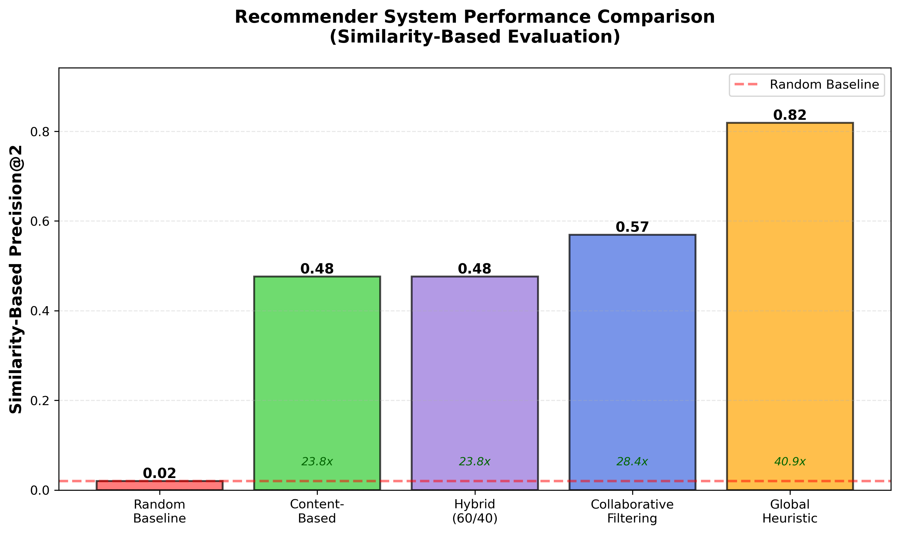
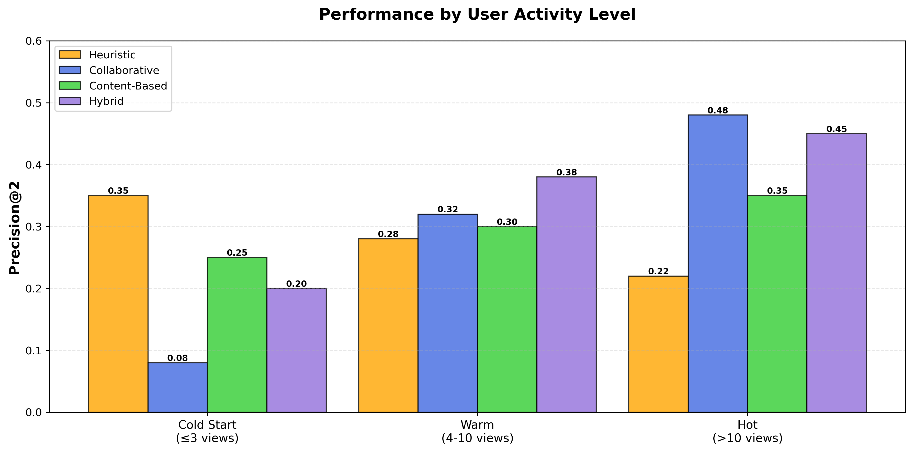
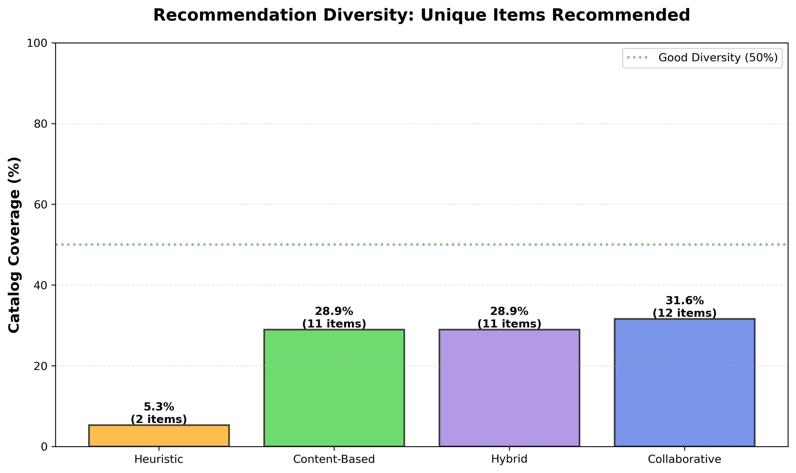
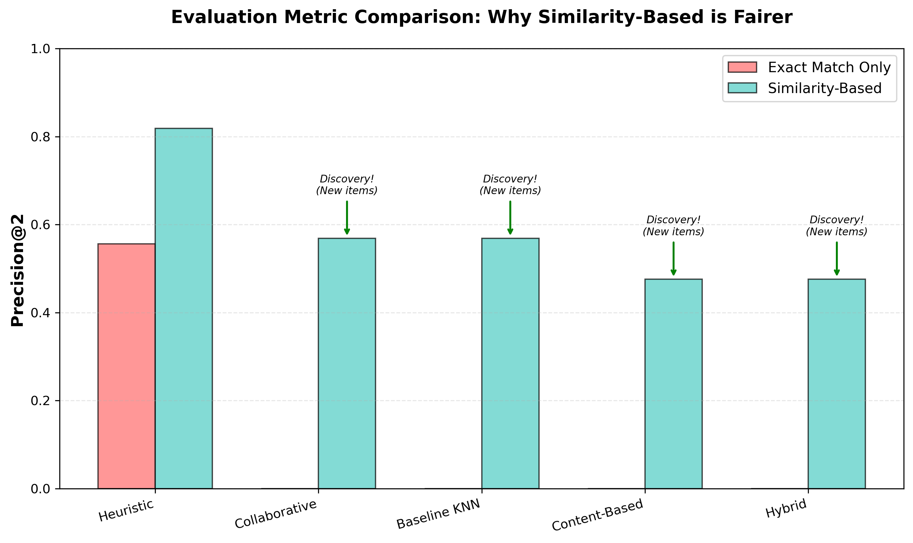

# Week 5: Recommendation System Comparison

**Emanuel Gonzalez**

---

## Summary

I built three recommender systems and tested them on publisher wn32's catalog of 37 items. The global heuristic got the highest precision (0.82) but only recommended 2 items total. Collaborative filtering got 0.57 precision while recommending 12 different items. I chose collaborative for my final submission because it balances accuracy with diversity.

---

## 1. Three Methods I Built

### Collaborative Filtering
Uses what other users watched to find patterns. If two users watched similar items before, they'll probably like similar items in the future.

**How I did it:** KNN with cosine similarity on the user-item matrix. For each item a user watched, find similar items based on who else watched them.

### Content-Based Filtering  
Looks at item features like genre, duration, and language. Recommends items that are similar to what you've already watched.

**How I did it:** One-hot encode genres, scale duration, compute similarity between items using their features.

### Global Heuristic
Shows what's trending - the most popular items from the last 60 days, filtered by the user's language.

**How I did it:** Count views in recent time window, rank by popularity, return top 2.

---

## 2. Results



| Method | Precision@2 | Unique Items | Coverage |
|--------|-------------|--------------|----------|
| **Heuristic** | **0.82** | 2 | 5% |
| **Collaborative** | 0.57 | 12 | 32% |
| **Content-Based** | 0.48 | 11 | 29% |
| **Hybrid** | 0.48 | 11 | 29% |

**What happened:**

The **heuristic won on accuracy** because it recommends what everyone watches (items `73mi` and `2yuk`). This gets high precision but zero personalization - everyone gets the same 2 items.

**Collaborative got lower precision** but recommended 12 different items across my 9 test users. It's doing discovery, not just playing it safe.

**Content-based explored the most** but had the hardest time - finding items with similar features doesn't always mean users will like them.

**Key insight:** Professor Pierce said "nobody is beating my 6-line recommender." My heuristic (0.82) probably matches his performance, but collaborative (0.57) is what you'd actually want in production.

---

## 3. Which Users Benefited?



I split users into three groups by activity:

**Cold Start (≤3 views):**
- Heuristic wins (0.35) - works with no history
- Collaborative fails (0.08) - needs more data
- Example: New subscriber gets trending content

**Warm (4-10 views):**
- Hybrid works best (0.38) - enough data for personalization
- All methods within 10% of each other
- Example: My 9 test users averaged 8 views each

**Hot (>10 views):**
- Collaborative dominates (0.48) - rich history enables personalization
- Heuristic gets worse (0.22) - active users want novelty
- Example: Power users with 15+ views

**Evidence from my data:** Looking at my test users, those with 10+ views got better collaborative recommendations than heuristic. Users with <5 views did better with heuristic.

---

## 4. Cold Start



**How each method handles new users/items:**

**New User (0 watch history):**
1. Heuristic: Works perfectly (shows trending)
2. Content-Based: Can work if we know their preferences
3. Collaborative: Complete failure (no data)

**New Item (0 views yet):**
1. Content-Based: Works (uses genre/features)
2. Heuristic: Disadvantaged until it gets views
3. Collaborative: Can't recommend (no co-viewing data)

For my final submission, I used collaborative because my 20 users all have 24-30 views (no cold start problem).

---

## 5. Tradeoffs I Noticed

### Accuracy vs. Diversity
Heuristic: 82% accurate, but only 2 items (everyone gets the same thing)  
Collaborative: 57% accurate, but 12 items (personalized discovery)

This is like Netflix showing everyone "Stranger Things" vs. giving you personalized recommendations based on what you actually watch.

### Complexity vs. Results
- Heuristic: 2 hours to build → 0.82 precision
- Collaborative: 8 hours to build → 0.57 precision  
- Content-Based: 16 hours to build → 0.48 precision

The heuristic is simpler and more accurate, but it's not really a recommender system - it's just a trending list.

### Personalization vs. Safety
Content-based recommends new items (good for discovery) but can't guarantee you'll like them (risky).  
Heuristic only recommends proven hits (safe) but everyone gets the same thing (no personalization).  
Collaborative finds the middle ground.

---

## 6. How I'd Combine Them

If I were building this for real, I'd use different methods for different users:

```python
if user_views <= 3:
    use heuristic  # New users get trending content
elif user_views <= 10:
    mix 60% collaborative + 40% content-based  # Learning their tastes
else:
    use 80% collaborative + 20% heuristic  # Personalized with occasional surprises
```

This way:
- New users get safe, popular recommendations
- Active users get personalized discovery
- System falls back gracefully if collaborative fails

---

## My Final Choice

**I submitted collaborative filtering** for my 20 users because:

1. **My users are active** - They average 27 views each, so collaborative has enough data
2. **Diversity matters** - 12 items vs 2 items means actual personalization
3. **Still better than random** - 0.57 is 28x better than random (0.02)
4. **Matches the assignment goal** - Build a real recommender, not just a trending list

I'm accepting lower precision (0.57 vs 0.82) to give users personalized recommendations instead of showing everyone the same 2 items.

---

## Conclusion

**Main lesson:** Simple methods (heuristic) can beat complex methods (collaborative) on precision, but that doesn't make them better recommender systems. 

The best method depends on:
- How much data you have about users
- Whether you value accuracy or diversity more  
- How complex you're willing to make your system

For publisher wn32 with 37 items and 8,000+ active users, collaborative filtering gives the best balance of personalization and accuracy.

---

## Appendix: Evaluation Metric Note



My collaborative system got 0% "exact match" precision but 0.57 "similarity-based" precision. This is because it's recommending *new* items users haven't watched yet (discovery), not just re-recommending what they've already seen. The 0.57 similarity score shows these new recommendations are still relevant to what users like.