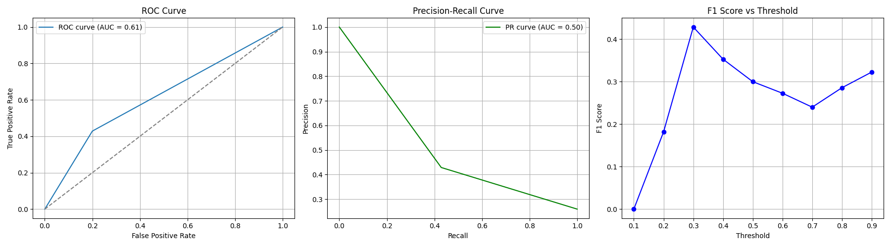

**Hahns Evaluation:**

ROC-AUC = 0.61
PR-AUC = 0.5
Optimized Threshold 0.3 =
F1 Score = 0.42857142857142855

The metrics we used for my evaluation were watch percentage >= 0.5 and top half recommendations.

If a piece of content had a watch percentage of 0.5 by an adventurer, we considered that content to be good. If a piece of content was in the top half of the recommendations given, we considered that good. We used these metrics to formulate a confusion matrix, which we used to create the ROC, PR, and F1-threshold plots.

My ROC curve is close to 0.61, which means it's similar to just being a random classifier, but it has some elements of being a good classifier. This is useful because both error types matter equally. My precision-recall curve indicates that my model is performing no better than a random guess. Overall, the evaluation of my recommender shows that the recommendations aren’t completely random and have some merit to it.

**Emanuel evaluation:**

ROC-AUC = 0.575
PR-AUC = 0.323
Best F1: 0.425 at threshold 0.10
My recommender used item–item filtering with cosine similarity. I started by splitting the data into 80% training and 20% testing for each user to avoid leakage. For each user, I looked at the items they had already watched and found other items that were most similar. Cosine similarity was chosen because it works well with sparse data, since it compares viewing patterns instead of raw counts. I combined the similarity scores to give each unseen item a final score, where higher scores meant stronger recommendations. This gave me a simple base, but because it only used co-viewing patterns and no extra features, the results were not very personal.

To evaluate, I treated the similarity scores like probability predictions in a binary classification task. If a user actually watched the item in the test set, that was a positive label. If they didn’t, it was a negative. Using this setup, I was able to generated three evaluation views:
ROC curve: showed how well the model told apart watched items from not-watched items at different cutoffs.
Precision–Recall curve: was more useful because the items users actually watched were much fewer than the ones they skipped.
F1 vs Threshold plot: showed the tradeoff between precision and recall and where the model worked the best.

The recommender ended up being weak overall. The ROC-AUC of 0.575 means the system was only a little better than random guessing. The PR-AUC of 0.323 was very low, which showed the model struggled with pretty bad data and couldn’t keep both precision and recall high at the same time. The best F1 score was 0.425 at a similarity threshold of 0.10, which means the model did slightly better when we lowered the cutoff, but performance was still poor.

The recommender didn’t do well for a few reasons:
Only used collaborative filtering: It didn’t check watch percentage, so a video someone barely clicked counted the same as one they fully watched. This would hurt the quality.
Sparse data: The publisher had thousands of users but only a few items. With so little overlap, cosine similarity wasn’t very strong.
No extra features: It ignored age, gender, or language, so every user was treated the same even though their tastes were different.

Overall, my recommender was a good first step, but it was too simple to perform well. Cosine similarity was able to capture some patterns, but the low PR-AUC showed that it struggled with rare positives. Ignoring watch quality also made the suggestions less meaningful.

**Ishwarya's Evaluation:**

The metrics for my recommender were ROC-AUC = 0.5737, PR-AUC = 0.0320.
We chose to do a split of 80% training and 20% testing split.
To be able to evaluate my recommender, I had to make some changes to be able to classify the results into a binary classification. My recommender works by taking a user's top rated content and finding similar content to recommend. This method made it very hard to get a good number of recommendations that overlapped with the 20% ground truth we had. Instead of just choosing 3 adventurers, I chose to test my recommenders on a wider set of users that met a few requirements. I find users in the testing set that have a list of content that they’re rated 4 or more, this is my ground truth. Then I find all the content that user has watched in the training set, and find a random one to put into my recommender. To make my y_actual array I check if the recommendations made are in the list of user liked content from the test dataset; 1 if it is, 0 if it isn’t. I compute the y_score array by calculating cosine similarity. I just accumulate these arrays for every valid user, and use them to calculate the metrics. For threshold analysis I use different thresholds of the similarity instead of checking if its in the user’s liked list or not for the binary classification instead.

According to the metrics, my recommender is pretty bad. The area under the curve for the ROC curve is 0.57, which means it’s barely better than randomly guessing. This make sense because my recommender was originally too strict. It relied solely on ratings, but there’s many users who don’t rate highly or even rate at all, and lots of content is not rated either. It would have been better to consider more features. The area under the curve for the PR curve was 0.03 which is really bad, which makes sense because of how random the recommendations were. Due to the bad recommendations, the F1-threshold analysis graph is also bad because the similarity scores are not able to be used to distinguish a good suggestion from a bad suggestion.

**Improvements:**

We built our new recommender off of Hahn's recommender because it had the best evaluation metrics. We chose to add a new feature using the region of the adventurer. We also decided to increase the amount of k neighbors the model is using because the increased dimensionality of the matrix means that the feature space increases. Using a smaller k may cause a narrow understanding of the data. We originally cutdown all content that has not been watched by the user over 50%, but decided to change that to 20% to increase the amount of data available. Based on this evaluation, the new recommender has a worse area under the ROC curve, but a better area under the PR curve. This means that this new recommender would be better when there is highly imbalanced data. It also focuses more on true positives, which is good for a recommender.

**Group Reflection**
We had a difficult time figuring out how to apply binary classification to our models. We ended up having to create slightly different evaluators for our recommenders due to this, which was unexpected. We learned that the amount of features used matter as much as how “good” they are. Originally we thought that the goal is to minimize the matrix we pass into the recommender, but after making our new recommender where we added another feature, we realized that’s not always true. The metrics changed our opinions about our recommenders. For example, based on the overall class ranking Ishwarya thought that her recommendation system was not great but also not horrible, but the metrics changed that opinion. In that assignment those adventurers were carefully chosen based on some requirements and only the top 2 were considered, so their outcome doesn’t reflect how good a model is. We realized a stronger approach for a recommender would use watch percentage to focus on high-quality content in addition to adding demographic features like age and gender to make results more personal, and filter by language so users only get items they can actually watch. By combining these improvements, the model could give much better and more relevant recommendations

**New Results**
Adventurer clrw was recommended m5mx and xvwf. Adventurer de6l was recommended 1t65 and tiw6. Adventurer h19e was recommended qtm6 and npzx. Adventurer m9n3 was recommended tiw6 and oe3q. Adventurer 6w1h was recommended 1t65 and tiw6. Adventurer uzl6 was recommended 36qb and eh7b. Adventurer 5khg was recommended 5bbj and ahtv.
Adventurer 7rwr was recommended tiw6 and 1t65. Adventurer 9i8a was recommended eh7b and vqod.

To understand why our recommender chose each content for the 9 adventurers, we decided to look into the demographic information of the content. For most of the recommendations we saw similarities in the genre and region of the adventurer’s enjoyed content and recommended content.

For example, we observed that most of the content that the adventurer uzl6 enjoyed was also enjoyed by adventurers from their region. eh7b is one of the recommendations made to them, and it shares the same region. A good majority of the content that the adventurer enjoyed was also from the COM genre, which is the genre of eh7b.
