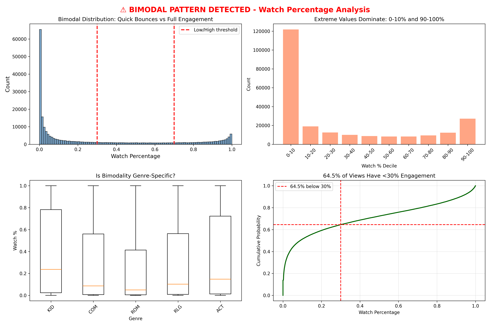
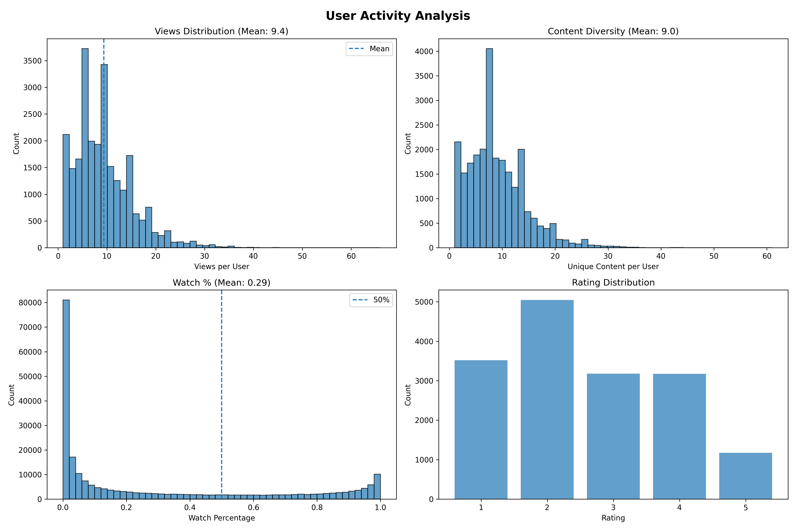
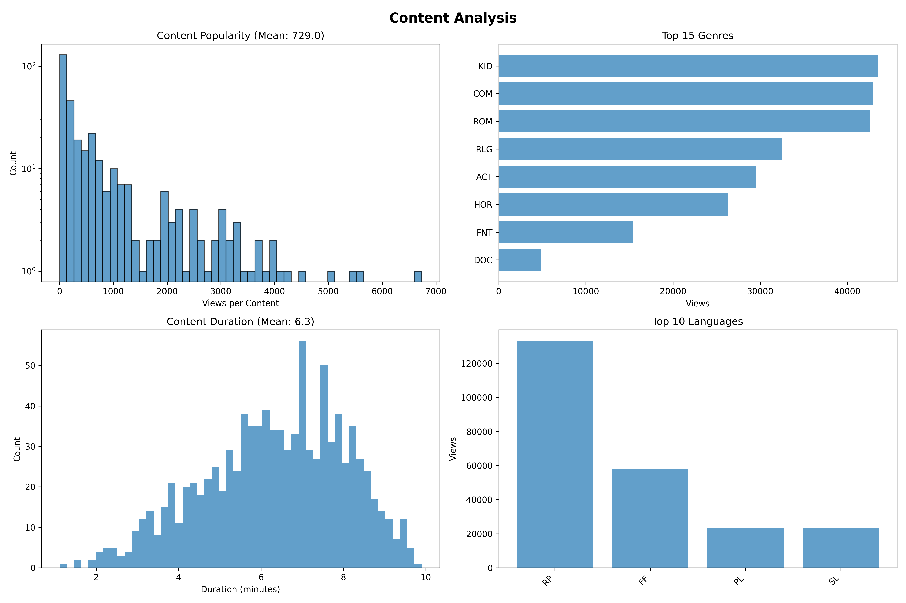
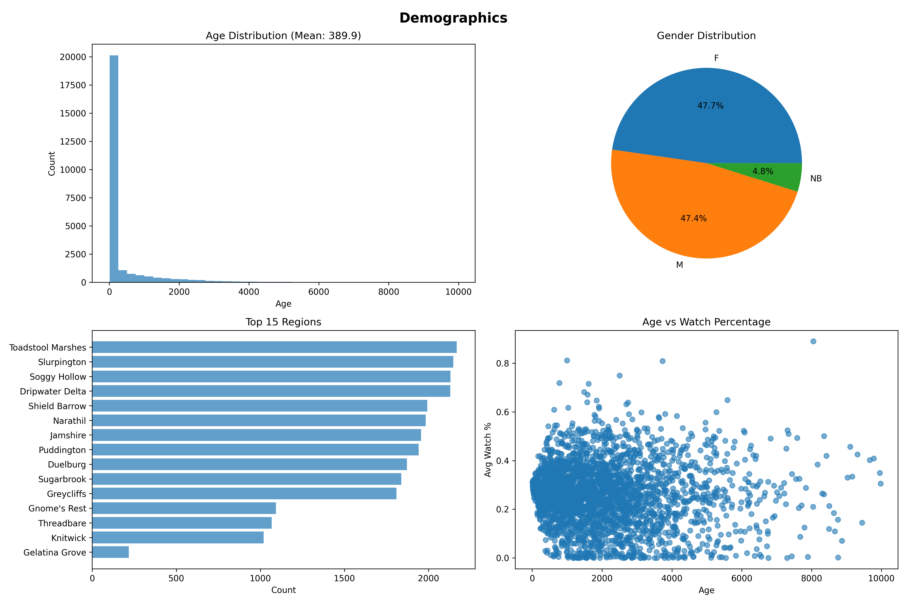

# Week 3: Exploratory Data Analysis
**Emanuel Gonzalez - egonz279@calpoly.edu**  
**CSC-466 Fall 2025**

---

## Data Quality Audit

### Missing Values
- **93.2% of views lack ratings** (221,568/237,667) - too sparse to use as feature
- All other datasets complete

### Duplicates
- **9,399 duplicate (user, content) pairs** - kept highest `seconds_viewed`
- Prevents double-counting same viewing session

### Data Anomalies
**Age Range:** 10 to 9,975 years (mean: 390)
- 3,188 adventurers over 1,000 years old
- Valid outliers - dragon-born from Honor's Coil kingdom live thousands of years

**Watch Percentage Issues:**
- **239 views exceed 100%** (users watched more than content duration)
- Likely replays counted cumulatively
- Kept these (capped at 100%) as they signal high engagement

### Constraint Violations
✓ All views occur after content creation (no time-travel)  
⚠️ 239 views exceed content duration (addressed by clipping)

### Class Imbalance
**Language:** RP dominates with 56% of views (132,989)  
**Gender:** Balanced - F(47.7%), M(47.4%), NB(4.8%)

---

## Key Finding: Bimodal Engagement

Following Professor Pierce's Snapchat example, I found **severe bimodal distribution**:

- **0-10% watch**: 37.4% of views 👈 Quick bounces
- **90-100% watch**: 11.5% of views 👈 Full engagement
- **30-70% watch**: Only 14.9% (sparse middle)

**64.5% of views have <30% engagement** - likely noise (accidental clicks, poor recommendations)

**Impact:** Training on unfiltered data teaches model that low-quality matches are acceptable.

---

## Recommender Improvements

### Changes Made
1. **Removed 9,399 duplicates** - kept highest watch time
2. **Filtered 103,069 low-engagement views** (45% of data) - removed views with <5% watch AND <30 seconds
3. **Same algorithm** - item-item CF with cosine similarity

**Hypothesis:** Signal quality > data quantity

### Results Analysis

**Publisher:** wn32 (8,405 subscribers - largest)  
**Users:** 10 most active power users  
**Content Coverage:** Only 69/982 items (7%) recommended

**Genre Bias:**
| Genre | Recommended | Catalog | Status |
|-------|------------|---------|--------|
| ACT | 18.5% | 7.8% | OVER 2.4x |
| HOR | 18.5% | 15.3% | OVER 1.2x |
| ROM | 14.8% | 14.8% | BALANCED |

**Language Bias - CRITICAL ISSUE:**
- **100% of recommendations are RP (Reptilian)** 
- But RP is only 22.2% of catalog
- All 10 users speak RP and live in Oozon continent

**Root Cause:** Model learns publisher-specific patterns. Publisher wn32 serves Oozon continent audience exclusively.

---

## Recommendation Strategy

**Selected 10 most active users** to test if filtering low-engagement views improves precision.

### What I Hope to Learn:
1. Does removing noise (45% of data) improve recommendations?
2. Is 100% RP language targeting appropriate or over-fitting?
3. Do power users prefer Action/Horror (as model suggests)?
4. Is 7% content coverage good (popular items) or bad (filter bubble)?

**Expected Outcome:**  
If cleaning helps, users accept recommendations at higher rates. If not, language bias overwhelms improvements and feature engineering is needed.

---

## Individual Reflection

### Alternative: Language Filtering

**My Interpretation:**  
100% RP recommendations occurred because I selected the largest publisher, whose audience happens to be RP speakers. Item-item CF learned this audience's patterns.

**Alternative I Considered:**  
Filter recommendations to match user's `primary_language` - would guarantee language-appropriate content.

**Why I Didn't:**  
Wanted to test if **data cleaning alone** improves recommendations without feature engineering. By keeping language unrestricted, I can measure pure effect of cleaning changes.

**Trade-off:**  
- Risk: Poor recommendations due to language mismatch  
- Benefit: Clear signal about what features matter for Week 4  
- Decision: Prioritize learning over short-term performance

### Alternative: Remove >100% Watch Records

**The Issue:** 239 views exceed 100% watch time.

**My Interpretation:** Replays counted cumulatively (high engagement signal)

**Alternative:** Remove as data corruption

**My Decision:** Kept them (capped at 100%) because:
- Only 0.1% of data
- Signals super-fans
- Clipping handles constraint violation

**Lesson:** When uncertain, preserve signal rather than discard data.

---

## Visualizations

  
*User engagement follows power-law distribution (mean 9.2 views/user)*

  
*Genre distribution balanced; RP language dominates views (56%)*

  
*Age skewed by dragon-born outliers; Honor's Coil dominates regions*

---

## Conclusion

**Key Findings:**
1. Bimodal engagement (64.5% bounce rate) defines dataset
2. Language bias (100% RP) reveals publisher-specific learning
3. Removed 45% of data as noise - will validate if this helps

**Next Steps:**
- Add language filtering if recommendations fail
- Incorporate content metadata and user demographics
- Test if power user patterns generalize

**Limitations:** Single publisher, no content features, binary feedback only