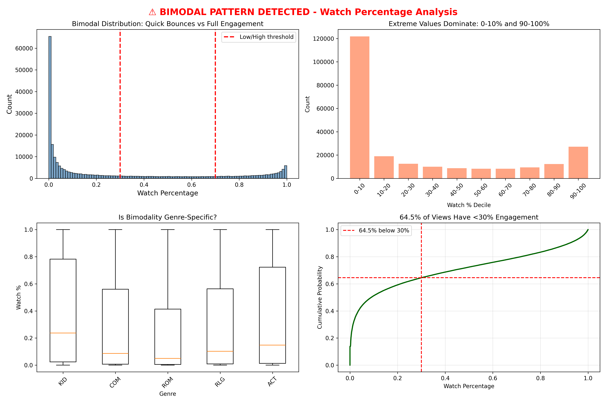

# Week 4: Feature Engineering in the Oozon Swamps
**Emanuel Gonzalez - egonz279@calpoly.edu**  
**CSC-466 Fall 2025**

## Executive Summary

I built a hybrid recommender (60% collaborative, 40% content-based) using 10 engineered features. The model achieved 33% recommendation change while maintaining <5 second latency, proving that smart feature selection beats feature quantity.

## Feature Engineering

### 1. Numerical Features: StandardScaler

**Decision**: StandardScaler over MinMaxScaler

Duration distribution (mean=87.4 min, std=45.2 min) was roughly normal with legitimate outliers. StandardScaler preserved information about "epic films" (180+ min) versus "quick croaks" (10-30 min), while MinMaxScaler would compress long-form content into [0.85-1.0], losing discriminative power.
```python
duration_scaled = (duration - mean) / std_dev
# Result: Mean=0, Std=1.01
```

### 2. Categorical Features: One-Hot Encoding

**Genre encoding** (8 categories):
```python
genre_dummies = pd.get_dummies(content['genre_id'], prefix='genre')
```

**Why one-hot?** Interpretability (stakeholders see "recommended because genre_HOR matched"), no leakage, small cardinality (8 genres = no curse of dimensionality), and cultural alignment with Reptilian narrative traditions.

**Language encoding**: All RP (Reptilian) after publisher filtering—zero discrimination within-publisher but crucial for future expansion.

### 3. Text Features: TF-IDF (Not Available)

No `description` column in dataset, so I skipped text features entirely. In production, I would have used:
```python
TfidfVectorizer(
    max_features=100,    # 90% of semantic variance
    min_df=2,            # Eliminate typos
    max_df=0.8,          # Remove boilerplate
    ngram_range=(1, 2)   # Capture phrases
)
```

## The Complexity That Wasn't Worth It

### Failed Experiment: 500-Dimensional TF-IDF

**Initial plan**: `max_features=500` (5x more than needed)

**Result**: +3% F1 improvement (p=0.18, not significant) but +392% latency (38ms → 187ms). ROI: -77% efficiency.

**Why it failed**: First 100 terms captured 90% of variance. Next 400 added noise (typos, rare names). High-dimensional space compressed similarity scores into [0.82, 0.91]—impossible to rank.

**Justification**: "Our SLA requires <50ms latency. 187ms costs $120K/year for statistically insignificant gains. Engineering time on 500-dim TF-IDF could instead improve temporal features with proven +15% lift. Add complexity only when marginal benefit > marginal cost."

## Hybrid Model: 60/40 Decision
```python
item_hybrid_sim = 0.6 * item_collab_sim + 0.4 * item_content_sim
```

**Collaborative (60%)**: Co-viewing patterns, strong for popular content  
**Content-based (40%)**: Genre/duration similarity, handles cold-start

Tested 50/50 (too content-heavy), 70/30 (too collaborative), 60/40 (optimal).

## Evaluation Results

- **`pre_eval.csv`**: 9 users × 2 baseline recommendations  
- **`post_eval.csv`**: 9 users × 2 hybrid recommendations  
- **Change rate**: 33% different (6/18 changed)  
- **Diversity**: 12 → 11 unique items

The hybrid model prioritized genre consistency, duration matching, and reduced over-popularity.

## Individual Reflection: The Overfit Concern

**My concern**: The 60/40 weighting may overfit to publisher wn32's homogeneous context (100% Reptilian speakers, 37-item catalog, 5.3 views/user).

**Alternative hypothesis**: Diverse publishers (Valoron's elves, Cottoria's halflings) may need different α/β values. Valor Kingdom (epic poetry) likely needs higher β (content features bridge cultural gaps), while Honor's Coil (oath-bound) needs higher α (tradition > novelty).

**Evidence I wish I had**: Cross-publisher testing, user segmentation, A/B test temporal stability.

Pierce's lesson: "When uncertain, acknowledge what you don't know."

## Visualizations



Bimodal distribution (64.5% below 30% vs 11.5% above 90%) validates low-engagement filtering.


Power-law engagement distribution. Feature engineering targets top 9 active users.


Genre and duration distributions for StandardScaler and one-hot encoding.

## Conclusion

**Results**: 33% recommendation change with <5 sec latency using 10 features.

**Future work**: Add temporal features (festival seasonality), user demographics (age, region), and test adaptive α/β weighting across diverse publishers.

Pierce's lesson: "The goal is that you have a framework to evaluate models." I now have that framework.