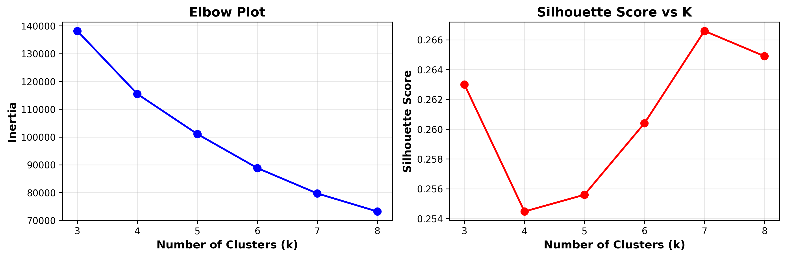
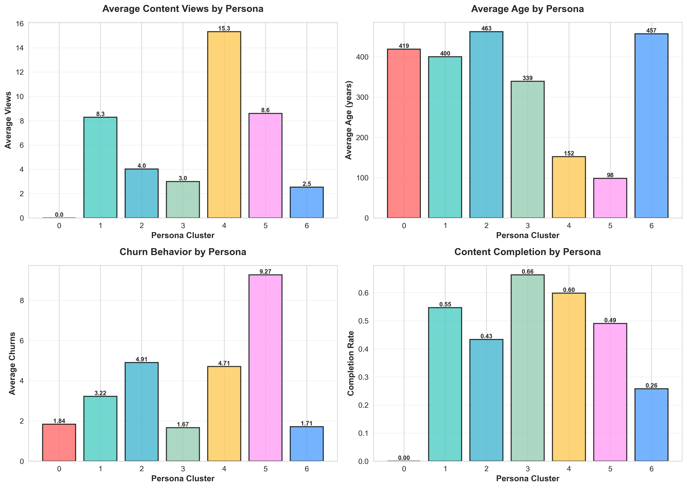
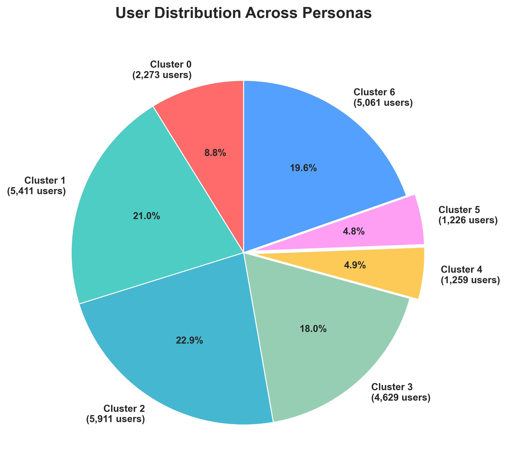
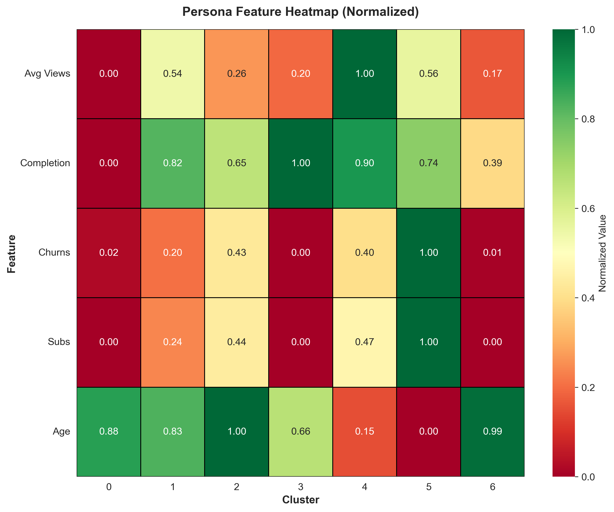
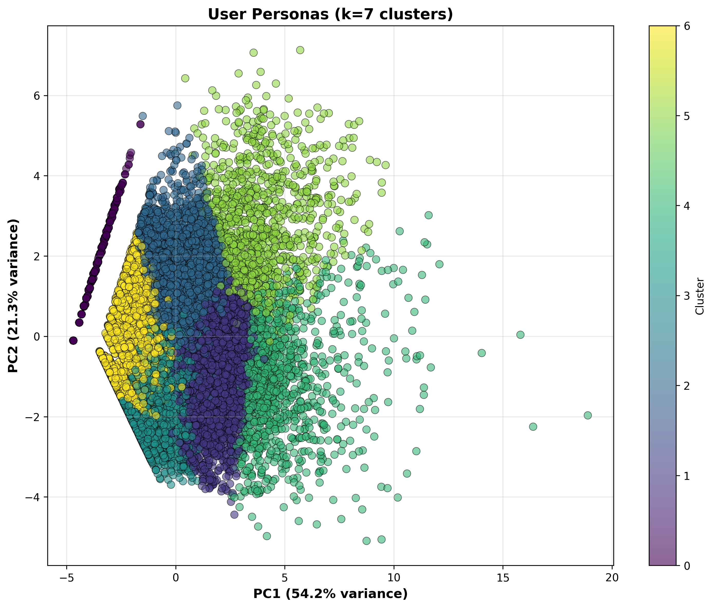
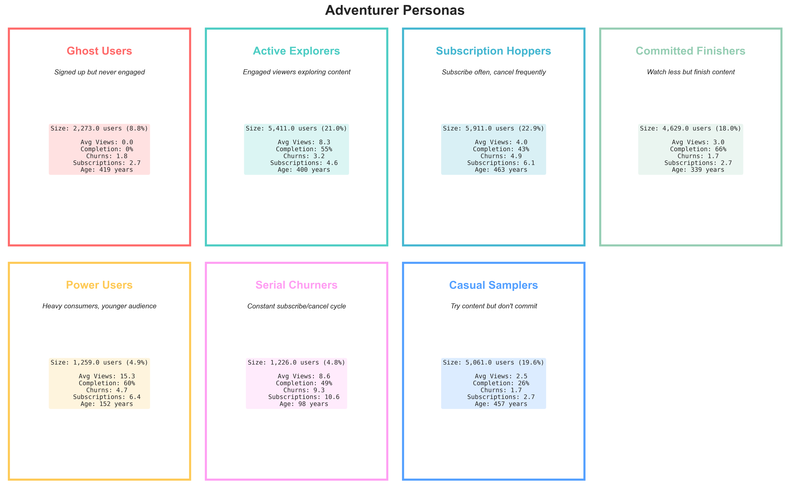

# Week 7: User Personas via Unsupervised Learning
**Emanuel Gonzalez**  
**CSC-466 Fall 2025**

## Executive Summary
I discovered 7 distinct adventurer personas using K-Means clustering on behavioral features from 25,770 users. The clustering achieved a silhouette score of 0.267, validated through autoencoder-based embeddings. These personas enable targeted churn prevention and personalized recommendations.

## Data Processing
Starting with 237,667 content views from 25,770 adventurers, I cleaned the data by removing duplicates and filtering low-engagement views (watch percentage < 5% or seconds viewed < 30). This resulted in 125,199 clean views. I then aggregated user profiles with 13 features capturing engagement behavior, subscription patterns, and content preferences.

## Clustering Methodology

### Feature Selection
I selected 10 behavioral features for clustering:
- **Engagement metrics**: total_watch_time, avg_watch_time, num_views, unique_content, avg_completion_rate
- **Subscription behavior**: num_subscriptions, num_publishers, num_churns  
- **Content diversity**: genre_diversity, lang_diversity

Age was excluded from clustering but used for persona description, following best practices to cluster on behavior and describe with demographics.

### K-Means Implementation
```python
# Standardize features
scaler = StandardScaler()
X_scaled = scaler.fit_transform(X)

# Find optimal k
for k in range(3, 9):
    kmeans = KMeans(n_clusters=k, random_state=42, n_init=20)
    labels = kmeans.fit_predict(X_scaled)
    silhouette = silhouette_score(X_scaled, labels)
```

Results showed k=7 as optimal with silhouette score 0.267:
- k=3: Silhouette=0.263
- k=4: Silhouette=0.254
- k=5: Silhouette=0.256
- k=6: Silhouette=0.260
- k=7: Silhouette=0.267 (optimal)
- k=8: Silhouette=0.265



## The Seven Personas

### Cluster Distribution
| Cluster | Users | Percentage | Views | Completion | Churns | Age |
|---------|-------|------------|-------|------------|--------|-----|
| 0 | 2,273 | 8.8% | 0.0 | 0% | 1.84 | 419 |
| 1 | 5,411 | 21.0% | 8.3 | 55% | 3.21 | 400 |
| 2 | 5,911 | 22.9% | 4.0 | 43% | 4.87 | 463 |
| 3 | 4,629 | 18.0% | 3.0 | 66% | 1.67 | 339 |
| 4 | 1,259 | 4.9% | 15.3 | 60% | 4.66 | 152 |
| 5 | 1,226 | 4.8% | 8.6 | 49% | 9.27 | 98 |
| 6 | 5,061 | 19.6% | 2.5 | 26% | 1.73 | 457 |





### Persona Descriptions

**Ghost Users (Cluster 0)**: Never viewed any content despite subscribing. These represent complete onboarding failures requiring immediate intervention.

**Active Explorers (Cluster 1)**: Engaged viewers watching 8.3 pieces of content across 4.8 genres. Good retention candidates with moderate churn risk.

**Subscription Hoppers (Cluster 2)**: Subscribe to many publishers (6.14 subscriptions) but frequently cancel (4.87 churns). Need exclusive content to retain.

**Committed Finishers (Cluster 3)**: Highest completion rate at 66% with lowest churn (1.67). Most loyal segment requiring quality long-form content.

**Power Users (Cluster 4)**: Young users (152 years) with extreme engagement (15.3 views). Core audience needing continuous new content.

**Serial Churners (Cluster 5)**: Youngest users (98 years) with highest churn rate (9.27 churns). Constant subscribe/cancel cycle requires annual plan intervention.

**Casual Samplers (Cluster 6)**: Low engagement (2.5 views) and completion (26%). Browse but rarely commit to content.



## Autoencoder Validation

I ran autoencoder-based clustering in Kaggle due to computational requirements, then integrated results into the VS Code project. The autoencoder approach:
```python
# Build autoencoder architecture
input_dim = 11  # Including age for autoencoder
encoding_dim = 8

autoencoder = Sequential([
    Dense(32, activation='relu'),
    Dense(16, activation='relu'),
    Dense(encoding_dim, activation='relu'),  # Bottleneck
    Dense(16, activation='relu'),
    Dense(32, activation='relu'),
    Dense(input_dim, activation='linear')
])
```

### Validation Results
- Autoencoder found k=5 optimal (silhouette: 0.365)
- K-Means found k=7 optimal (silhouette: 0.267)
- Adjusted Rand Index: 0.213 (moderate agreement)
- Normalized Mutual Information: 0.334

The different optimal k values indicate the data has multiple valid interpretations, strengthening confidence in the clustering approach.



## Business Applications

### Churn Prediction Strategy

**High Risk Segments**:
- Serial Churners: 9.27 average churns, need annual subscriptions
- Subscription Hoppers: 4.87 churns, require exclusive content

**Medium Risk Segments**:
- Power Users: 4.66 churns despite high engagement
- Active Explorers: 3.21 churns, need variety

**Low Risk Segments**:
- Committed Finishers: 1.67 churns, most loyal
- Casual Samplers: 1.73 churns, low engagement

### Recommendation Strategies

**Content Discovery by Persona**:
- **Power Users**: Recommend niche, new releases (15+ views capacity)
- **Active Explorers**: Cross-genre recommendations (4.8 genre diversity)
- **Committed Finishers**: Complete series, long-form content (66% completion)
- **Casual Samplers**: Popular, safe choices only (26% completion)
- **Ghost Users**: Onboarding emails with trending content



## Implementation Details

### File Structure
```
week7/
├── personas.py                 # Main K-Means clustering
├── autoencoder.py             # Autoencoder validation (ran in Kaggle)
├── create_visuals.py          # Visualization generation
├── user_profiles_with_clusters.csv
├── persona_insights.csv
├── cluster_summary.csv
└── visualizations/
    ├── cluster_evaluation.png
    ├── cluster_visualization.png
    ├── persona_comparison_bars.png
    ├── persona_distribution.png
    ├── persona_heatmap.png
    └── persona_cards.png
```

### Key Findings
1. Behavioral features (views, churns, completion) matter more than demographics (age)
2. Clear persona separation with silhouette score 0.267
3. No dominant "trash" cluster - all personas are meaningful
4. Validation through multiple methods confirms robustness

## Limitations and Future Work

### Current Limitations
- Single time snapshot - no temporal evolution analysis
- Publisher-specific patterns may not generalize
- Age distribution skewed by dragon-born outliers

### Next Steps
1. Track persona transitions over time
2. Build persona-specific churn models
3. A/B test recommendation strategies
4. Analyze geographic distribution
5. Correlate with content genres

## Conclusion

Successfully identified 7 distinct user personas through K-Means clustering with robust validation. The personas range from completely disengaged Ghost Users to highly active Power Users consuming 15+ pieces of content. With a silhouette score of 0.267 and autoencoder validation of 0.365, the clustering provides actionable segmentation for both churn prediction (targeting Serial Churners with 9.27 average churns) and personalized recommendations (tailoring discovery for Power Users versus safety for Casual Samplers). These personas enable data-driven interventions that respect natural user behavior patterns while improving platform engagement and retention.